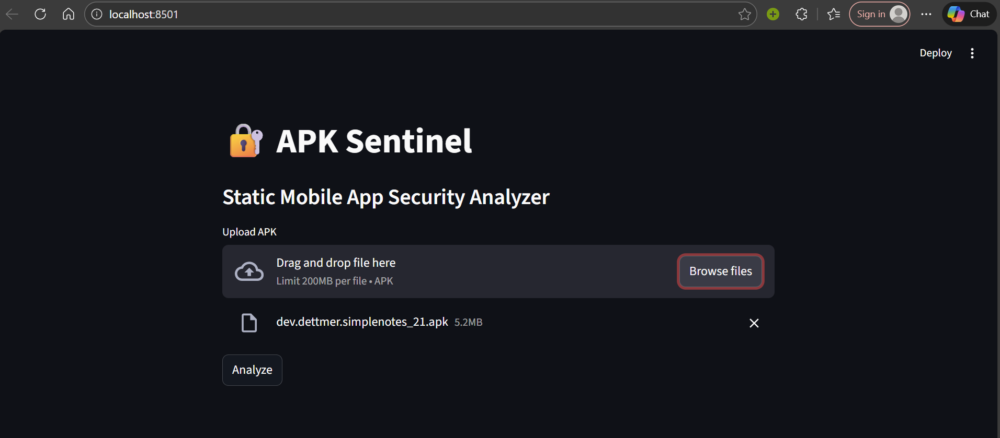
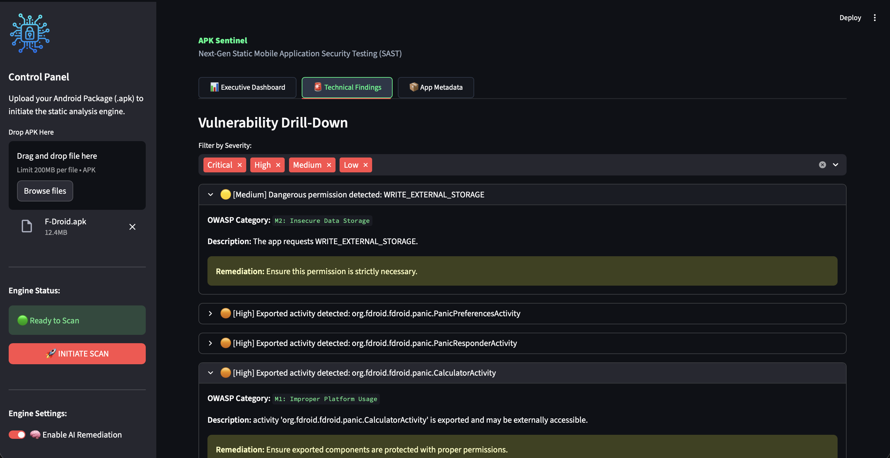
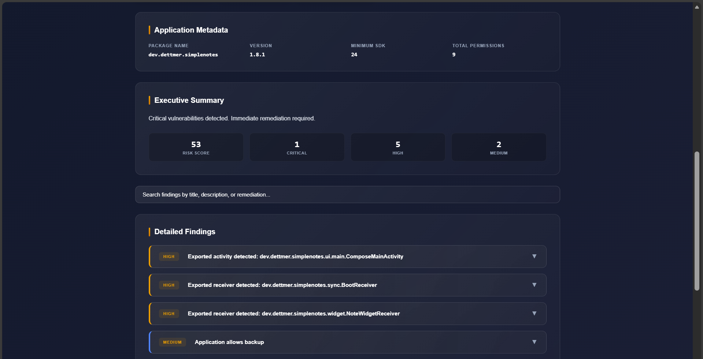
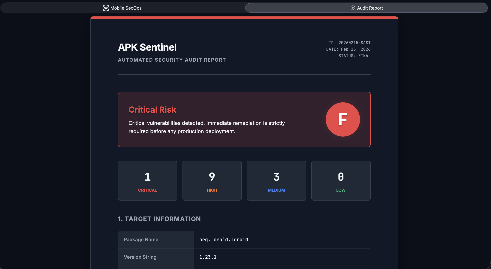
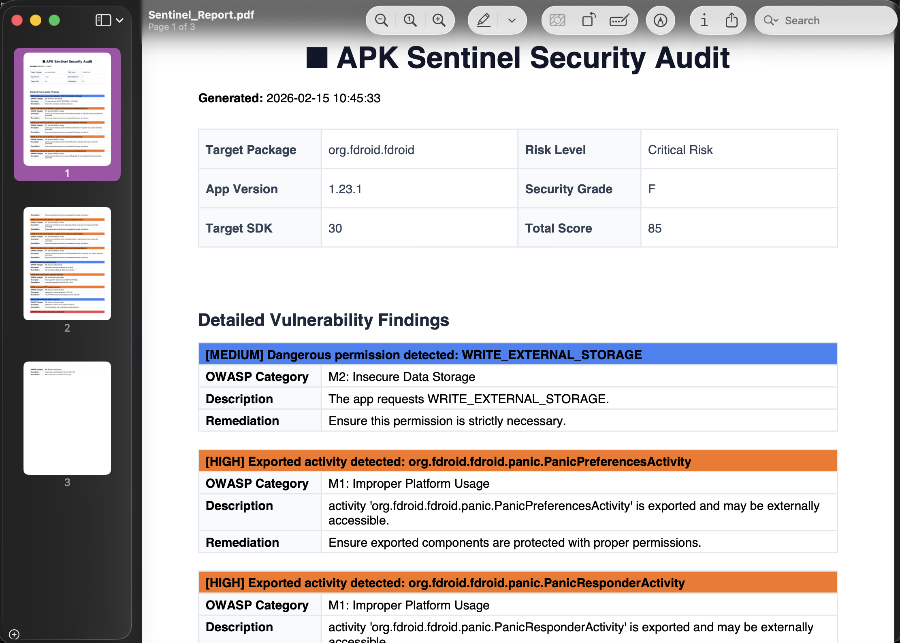

# 🛡️ APK Sentinel

[](https://github.com/YOUR_USERNAME/KrackHack-apk-sentinel/actions)
[](https://www.python.org/downloads/)
[](https://opensource.org/licenses/MIT)

**APK Sentinel** is a next-generation static mobile application security testing (SAST) platform. It goes beyond simple bug hunting by integrating **AI-driven remediation** and **automated CI/CD guardrails** to secure the mobile supply chain from development to production.


---

## 🚀 Key Innovation: AI-Powered Remediation
Unlike traditional scanners that provide generic advice, APK Sentinel features a **Post-Processing AI Engine** powered by Google Gemini. 

* **Contextual Fixes:** Analyzes the exact code block where a vulnerability was found.
* **Actionable Patches:** Generates ready-to-use code snippets (e.g., Network Security Configs or EncryptedSharedPreferences implementations) to reduce developer friction.
* **Compliance Mapping:** Automatically tags vulnerabilities with **GDPR** and **HIPAA** risk warnings.

---

## 🛠️ DevSecOps Integration (The Gatekeeper)
APK Sentinel is designed to live inside your GitHub workflow. Our included GitHub Action ensures that security is a blocker, not an afterthought.

* **Automated Scanning:** Every Push/Pull Request triggers a headless scan.
* **PR Blocker:** The pipeline returns a non-zero exit code on **Critical** findings, physically preventing insecure code from being merged.
* **Artifact Generation:** Audit reports (PDF/HTML) are automatically attached to the GitHub Action run for security review.


---

## 📋 Features

### Static Analysis Engine
* **Secret Detection:** Scans for AWS keys, Firebase URLs, and hardcoded API tokens.
* **Manifest Audit:** Flags dangerous permissions and exported components (Activity Hijacking risks).
* **Crypto Audit:** Detects weak algorithms (MD5, SHA1) and cleartext HTTP traffic.
* **Compliance:** Maps findings to the **OWASP Mobile Top 10**.

### Enterprise Reporting
* **Dark-Mode Dashboard:** High-fidelity Streamlit interface for manual audits.
* **Audit-Ready PDF:** Professional whitepapers with severity tables and compliance stamps.
* **JSON Export:** Raw data for integration with JIRA or other security dashboards.

---

## 💻 Installation & Usage

### 1. Setup
```bash
git clone [https://github.com/DiyaMenon/KrackHack-apk-sentinel.git](https://github.com/DiyaMenon/KrackHack-apk-sentinel.git)
cd KrackHack-apk-sentinel
python -m venv venv
source venv/bin/activate  # venv\Scripts\activate on Windows
pip install -r requirements.txt
```
### 2. Configuration
Create a `.env` file in the root directory:
```env
GEMINI_API_KEY=your_google_ai_studio_key
```
### 3. Run Streamlit App
```bash
streamlit run app.py
```
### 4. App Runs at
```bash
http://localhost:8501
```

## The final OUTPUT














